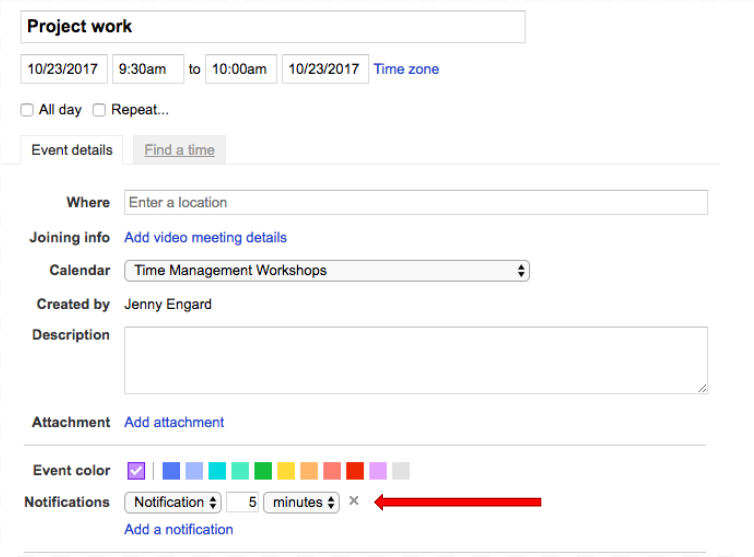
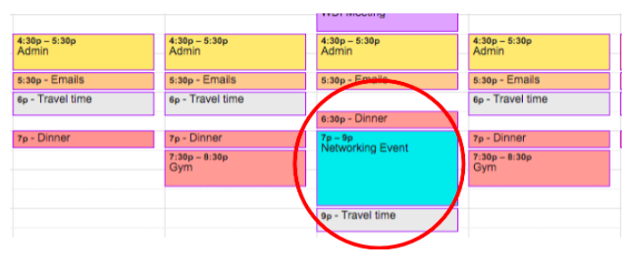

# Planning and Calendaring Your Week 

## Objectives:
At the end of this lesson, you will be able to: 
* Plan your tasks on a calendar for each week 
* Identify ways in which pomodoros can be integrated with calendar tasks 
* Articulate the benefits of daily reflection 
  

## Rationale:
Once your tasks have been prioritized, getting them onto a calendar puts your productivity plan in motion, so that you don’t have to think about it every day. 
  

##Calendaring Your Week 
So you have your list of tasks. You know how long each one should take you. You know how important each one is in the grand scheme of all of the things that you are doing. So now what? 
  
Calendaring your week is a good habit to get into for a few reasons: 
It gets your tasks off of the paper, out of your head, and into a system that passively tells you where to be and when 
If you share your calendar with others, people can work around your schedule as events come up 
With reflection, you understand when you are the most productive each day
Once your tasks are plotted on a calendar, you will have a better at a glance view of when you are available, making meetings easier to schedule. 
  
_Note_: In this lesson, we will be using Google Calendar to keep track of tasks, as it’s pretty widely used and easily shared with others. That being said, you are welcome to use any calendaring system you wish. 
  
## Initial Setup Rules 
Before you get everything plotted out on a calendar week over week, it’s helpful to remember a few bits of housekeeping so that you don’t get blown away by the task! 
  
**Rule 1: Follow your FARE list** 
Once you have prioritized your tasks using FARE, it’s time to calendar them in order of importance. That means, the first thing on your Foundational schedule gets first dibs on your blank slate of a weekly calendar- after all, that’s the most important thing! 
It’s often tempting to jump around your list, but following this order ensures that the things that truly matter to you get the airtime that they deserve. 
  
**Rule 2: Don’t forget your breaks**  
In Lesson 1, we covered the pomodoro technique, which will give you 5 (or 15) minute breaks by default at the end of each task. If you set up notifications on your calendared events, you can build in these breaks so you don’t have to think about setting a timer each time- your calendar will remind you with a chime and a pop-up 5-15 minutes before your next task is scheduled to start! 
  

Imagine living in a world where you live by your calendar, and don’t have to think about what’s happening next! By performing this small step for all of your tasks, you have a constant stream of feedback telling you what is happening next so that you focus on your tasks at hand. 
  
**Rule 3: Think about your own patterns as you schedule your tasks** 
When do you do your best reading? When are you more of a people person? When do you do your best coding? Can you work on one task for a long period of time? Or do you need to switch things up throughout the day? 
  
These answers are different for everyone, and will require a little bit of thought and reflection, but once you have given these some serious thought, planning your day and week will be a lot easier. 
  
To give you some insight into my schedule:
  
I know that I typically do my best writing early in the morning and late in the afternoon, so I schedule my email blocks for first and last thing in the day. I also know that I do my best reading at night, so I’ll usually make it a point to do this after I’ve had my dinner. I also am most a people person in the middle of the day, so I try to leave my schedule open around lunch (it’s also when most people are available to meet for coffee!). 
  

**Rule 4: Routine is easier to maintain than change**  
As you’re getting into the habit of managing your time, it’s a good idea to give yourself a set routine at first. If you’re reinventing the wheel every single day, you’re setting yourself up for confusion- plus you may not be getting everything done as efficiently as possible. 
  

Think about your morning routine. It’s very likely that once you get out of bed, you probably do things like make breakfast/coffee, shower, read the news, and brush your teeth seemingly without thinking. Why is that? Because you’ve set a habit of doing things in a certain order, it’s likely that they come easier to you. Managing your schedule is similar. If you set up recurring tasks to happen at the same time each day, you’re much more likely to flow into them day over day instead of trying to remember when you do what. 
  
**Tip- Repeating Events** 
When you first look at your task list for the week, it’s very easy to be initially overwhelmed at the idea of placing it all on a calendar, let alone managing a list of hundreds of small tasks. Fortunately, the calendaring process can be simplified if you’ve already done most of the work of timeboxing and prioritizing. 
  
When you look at your week, you probably notice that there are a lot of tasks that happen on a regular basis and set periods of time. After all, you eat regularly, you sleep often, and you bathe every now and then (I hope!). You may also notice that you have meetings that happen at the same time each week. The great news about these types of tasks is that by setting these tasks to repeat, you only have to put them on the calendar one time, leaving you plenty of time each week to devote attention to the things that change - be they ad hoc meetings, project periods, etc.. Once these are on the calendar, you can always move them around later to accommodate other tasks without losing sight of how much time they take.  
  
For example, say that you normally have commute time from 6:00pm-6:40pm, but you want to head to a networking event close to work that begins at 7:00pm and ends at 9:00pm. By having a repeating event on your calendar, you can still maintain awareness of your commute time, but you also have the autonomy to decide that your commute will take place at 9:00pm instead of 6:00pm, freeing up space for your dinner during the 6:00pm hour. 
  

  
**Rule 5: Reflect every day and every week** 
As you have learned previously, the act of reflection helps you solidify the learning you have already done, making you more ready to implement changes to your productivity moving forward. 
  
At the end of each day, set aside some time to reflect on your schedule. Ask yourself: 
  

* How well did I adhere to my timeboxes? Did I over- or under-estimate the time tasks would take me to complete? 
* What tasks did not get accomplished today that should have been? How much time do I need to accomplish these tasks, and when will I accomplish them? 
* What’s on my plate tomorrow? Do I need to adjust my schedule? 
  

At the beginning of each week, make sure that you give yourself an hour to plan your upcoming seven days, using the reflections that you have gathered at the end of each day along with the tasks that you want to accomplish in the next week. As you progress with this task week over week, you will find yourself becoming more aware of what to expect and how long tasks will take you, making you more efficient in the long run- and shortening the amount of time you need to plan your week! 

