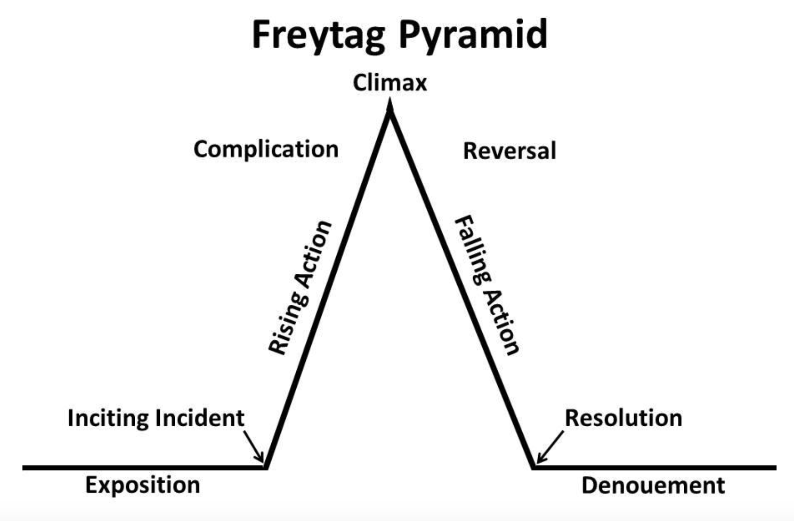

# Telling Your Story

## Objectives
By the end of this lesson, you will be able to:
 - Explain what makes a story compelling and what elements of story telling you can use to make yourself memorable

## Rationale

As you go through this program at Galvanize, and into your new career as a data scientist or software engineer, you will spend a lot of time talking about where you have come from, and what has brought you to where you are today.

These details are going to be your *story*. Understanding - and telling - your story in a compelling way is a big part of creating your *personal brand*. It’s important to start crafting this narrative now, because you will be using it as you network, create an online presence that reflects your career transition, and during the interview process. 

### What makes a great story?

Do you have a favorite book, or a story that really stuck out to you in childhood? What made it so memorable? If you had to tell the story to someone else in less than a minute, how would you do so?

You would probably notice that the main elements of your favorite story follow a predictable *story arc* (or what some of us literature nerds know as Freytag’s Pyramid):

**Exposition:** The background - how things were at the start, before anything interesting happens.
 
**Inciting incident:** A specific event that starts a chain of conflicts
 
**Rising Action:** The chain of conflicts that are going to lead to major changes for the main character.
 
**Climax:** The *turning point* - most intense part of the story. Will the main character win or lose?
 
**Falling Action:** The action that comes after the climax. What happened as a result of the climax?
 
**Resolution:** Ties all the loose ends together, hopefully in a positive way!

 
 
Let’s look at an example:

**Exposition:** Carlos is a hard working student who wants to help make the world a better place. He is successful in school through college, where he studies Sociology with a minor in Urban Planning. 

**Inciting incident:** Carlos discovers that it is difficult to find full-time work as a sociologist working on substantive problems, and that to really contribute as an Urban Planner he will need to work with data on a large scale. Carlos enrolls in the data science program at Galvanize. 

**Rising Action:** Carlos moves out of state and studies hard at Galvanize. He struggles with both stats and programming, but keeps up progress due to his study skills, discipline, and passion to make the world a better place. 

**Climax:** During the middle of the program, Carlos is overwhelmed by the variety of new approaches, riddled with imposter syndrome, and unsure of how his learning is connected to his ultimate goals. Carlos has a meeting with his lead instructor, who reassures Carlos that he is doing well and will be successful. Together they design a capstone project where Carlos will use data on sound and sound barriers to understand urban high-decibal hotspots in an effort to reduce them.

**Falling Action:**  Carlos throws himself into his capstone project as he is increasingly excited about the prospect of using data science to help real people. He gives an outstanding presentation, and is hired by a local contracting firm specializing in sound reduction and the creation of oases of calm in the City. 

**Resolution:** Carlos develops an outstanding career as an Urban Planner in San Francisco, and helps protect residents from noise pollution and overwhelming stimulus. 

 
 
**Now, YOU are the protagonist**

When you’re talking about yourself, you want to craft a narrative where YOU are the main character, and your audience is invested in your story - and your success. When you craft your story well, you will leave your audience wondering what is going to happen next for you - and eventually, they may even want to help you on your way!

You have one thing going for you right away: stories about *transitions* are some of the most compelling stories out there (not least of all because transitional life phases tend to be quite emotional)! Look again at the pyramid above. You won’t have all the parts of your story just yet. If your Climax is “I came to Galvanize to become a data scientist/software engineer”, what would the other parts of your story be so far? What is your exposition, inciting incident, and rising action?

Can you imagine what your falling action and resolution will be?

 
 
**A story is not a list of facts**

Look at the two stories that follow. Which one is more compelling? Why?
 
 
**Story 1**

I got a degree in business a few years ago. Then I worked at a financial company, where I mostly was responsible for looking at data in spreadsheets. My boss didn’t always give me enough work to do, so I taught myself some SQL in my spare time to make my job easier. I was bored a lot, but I stayed put because of the recession. On the side, I learned some HTML and CSS. Now that I feel like it’s a better economic climate, I figured I should try something new, and programming seems like a pretty good area to get into right now, so I came to Galvanize, and plan to be a software engineer. 
 
 
**Story 2**

I studied business in college because I’m fascinated by how small businesses can be competitive and grow. It’s something that’s always been interesting to me - even as a kid, I had great ambitions for running lemonade stands, and at one point had several going throughout my neighborhood. After I finished school, I worked at a financial company that specifically serviced small business owners and tried to help them make sense of their finances. Initially a lot of the work I was doing was in Excel, but during a slower period I decided to teach myself SQL. That was my entry point into programming - I was hooked, and had to learn more! In my free time I learned HTML and CSS, and also started learning more about the impact of technology on small businesses. I recently decided to take the dive into an immersive, full-stack Javascript course at Galvanize, where I’m becoming a software engineer. After this, I want to combine my passion for business with my passion for programming, and either help a start-up grow, or join a company that is making a product that helps small businesses.
 
 
