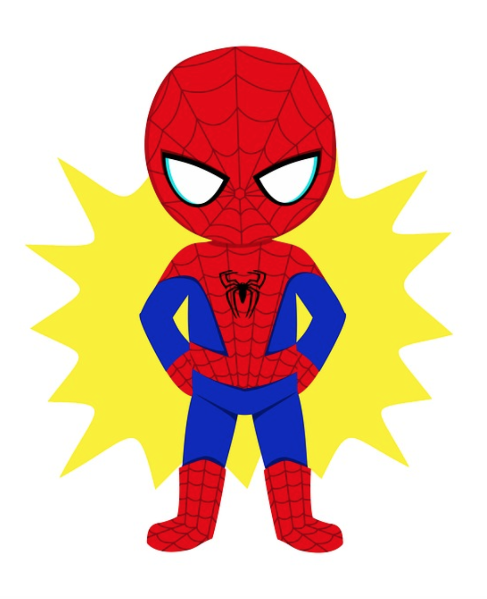

# Three Kinds of Introductions

## Lesson Objectives:
By the end of this lesson, you will be able to:
* Name three kinds of introductions, and when each is appropriate to use
* Explain what makes a personal introduction compelling and memorable
* Write your “origin story” introduction

 
## Rationale:

Your personal introduction is arguably the most portable tool within your job search toolkit. You might need to write it in a cover letter, include it in an email, or use it when you strike up a conversation with the passenger next to you on the train/plane/bus. It gives you complete control over how you are delivering your brand, and your intention for the conversation that will follow.

 
 
### The Basic Introduction

There are three kinds of introductions you may end up using in a networking situation.

The first is the **basic introduction.** As you can probably guess from the name, this is going to be pretty straightforward, and consists of 3 parts:

  * Greeting and Name
  * Anchor
  * What you do

Before we move on…
 
 
### What is an anchor?

Your anchor is *what you do* and *how you want to be viewed!* The rest of your conversation (or someday soon, your resume, cover letter, LinkedIn profile, etc.) will be viewed through the lens of understanding you as your anchor. 

Your anchor for the time being is “web developer/software engineer” or "data scientist". 

Practice saying to yourself: “I’m a software engineer!” or "I'm a data scientist!"

This might feel weird right now - after all, you’ve just started this course! But you ARE a software engineer/data scientist, this is your brand, and from this day forward, you are going to call yourself a software engineer/data scientist!

 
*The exception:*

As you go through this course, you may decide that you want to start to specialize. Your anchor may change to “I’m a front end engineer”, or “I’m a back end engineer”, or “I’m a QA engineer,” or "I'm a machine learning engineer" or "I'm a data engineer" or "I'm a data analyst", etc. Once you decide to specialize, that’s ok - but for now, call yourself a web developer/software engineer, or data scientist. 

 
*Here’s an example of a basic introduction:*

“Hi, I’m Mary Ann. I’m a Career Coach at Galvanize, where I help our students land their first jobs in the tech industry as data scientists or web developers.”
 
 
### The “Origin Story” Introduction

The **“origin story” introduction** is going to be a bit more involved than the basic introduction - and is going to offer more compelling information about who you are.

The parts of the “origin story” introduction are:

  * Greeting and Name
  * Anchor
  * Background
  * Motivation
  * Galvanize Statement
  * Intent
 

In this introduction, you get to delve into some interesting teasers that will allow for follow-up questions from your audience.

The most important part of this introduction is your **motivating statement.** When you talk about something that you are passionate about, you become more engaging, relatable, and memorable.

Believe it or not, *there are bad motivating statements.* If your motivating statement is one of the following, or something similar, *please do some more reflection and find something else:*

  * I want to be a software engineer/data scientist because I don’t know what else to do with my life
  * I want to be a software engineer/data scientist because my parents/spouse told me to
  * I want to be a software engineer/data scientist because those jobs pay well
 

Here are the additional parts of the “origin story” introduction, broken down:

**Background:** what did you do prior to coming to Galvanize? If you want to go into detail, focus on the highlights/achievements.

**Motivation:** At some point, you decided to become a software engineer/data scientist. What led you to that decision? What was your moment of realization? Why are you passionate about doing this?

**Galvanize Statement:** What are you doing right now? What are you learning at Galvanize?

**Intent:** What are you going to do with your new skills in the future? Are you going to join a certain industry? Are you hoping to make an impact in a certain field or for a certain group of people?

 

*Here’s an example of an origin story:*

“Hi! I’m Mary Ann. I’m a career coach at Galvanize with a background in recruitment. When I was a recruiter, I was bothered by how many industries claimed to be meritocracies when they were not at all, so I started working on finding ways to increase opportunities for people who weren’t getting them. Along the way, I started my own business, and then worked at an early-stage YC startup that shared my interests. At Galvanize, I’m working with web development and data science students from diverse backgrounds, and am helping them use their new skill sets to land their first jobs in tech.”

 

Can you find all the different components of the “origin story” in this introduction?

 
 
### The Full Background Story

Full disclosure: *you will almost never use the full background story!* This is where you go into detail about what you’ve done in the past, as a monologue. An example of when you might use this is if you are if you are a speaker at a conference or a meetup and are asked to introduce yourself at length.

Nevertheless, it’s important to look at the kinds of things you would be expected to talk about, because many of these things are the same kinds of follow-up questions that you will get in a more normal networking situation.

You should be ready to talk about…

  * Your formal education and other interesting things in your background
  * How that education led to your career choices or to Galvanize
  * How your career impacted you and key choices you made, key successes you had
  * What your overriding motivations are
  * Why you came to Galvanize
  * What you are learning at Galvanize
  * What you want to do in the future - in detail
  * What makes you unique and how you add value  
 
 

### Continuing the Conversation

The goal of a personal introduction is to capture the attention of your audience, and ending an introduction takes almost as much forethought as starting it (though with perhaps less anxiety). You have already set the timing and tone by understanding your audience; end your personal introduction with a question the continues the conversation or - if you are in an interview setting - reiterate that your background brings you to your interest in this role or conversation. 

In Unit 2, you will learn more about the kinds of questions to ask in a networking situation. For now, practice talking about key talking points (see a list in the previous section about the Full Background Story), and continue reflecting on the content such as your motivators and what makes you unique. 
 
 
### The Importance of Practice

The moment you start to introduce yourself, you are establishing your brand and the tone of the conversation. You want to know exactly what you want to say, and have a repertoire of available talking points that you are ready to tailor for your audience...but you don’t want to come across as though you are reading from a cue card (it may seem counterintuitive, but the *more* you have practiced your introduction, the *more natural* you will sound!). Writing your standard introduction out and revisiting that content will allow you to pull it up from memory at any time. 

After creating the content and understanding the fundamentals of the introduction, the most difficult part about an introduction is simply starting it. That greeting is key; after the “Hi, my name is…” to a stranger, employer, recruiter, or colleague, the rest of the talking points flow easily. So practice. Practice with your Galvanize colleagues, your Career Services team members, and even your friends when you are out socially. 
