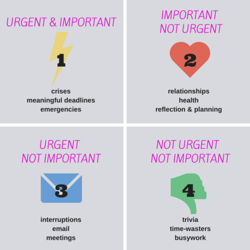
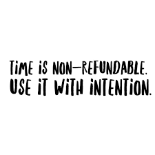

# Lesson 5: Time Management For the Job Search 

## Objectives:

By the end of this lesson, students will be able to: 

* Understand the relationship between time management and a healthy job search 
* Identify the weekly careers goals that you will want to achieve as a graduate 
* Use critical thinking to prioritize tasks day over day 
* Regulate your schedule using reflection and tools 

## Rationale: 
You’ve probably heard this already, but your job search should be treated like a job in and of itself. Setting an effective schedule means that you are more likely to show up and do the work, and *doing* the work means that you will *get* the work.

### Why Schedules Are Important  

Imagine that you have been given access to an entire closet full of art supplies and the instructions to “make a masterpiece.” 
  
Now, imagine that you are given access to an entire closet full of art supplies and the instructions to make a painting that is approximately 20 inches by 20 inches, features an image of a piece of fruit, and has a color palette containing four colors of your choosing. Oh, and to make it a masterpiece. 
  
Which of these two masterpieces would you be likely to create first? 
  
For most people, the choice that inspires immediate action is the second assignment, because while it allows for a relatively great deal of creative freedom, there are defined constraints that give the person creating it a sense of what materials to work with, how big the work should be, and what the expected result should be- and this makes it much easier to get started on the project. 
  
Approaching your schedule can feel very much the same way as you graduate and get ready for your job search. After weeks of having your day accounted for in timeboxed chunks, you will be going into a blank slate in terms of your time. While this gives you a lot of control over what you will be doing with your day, it can also make you overwhelmed with the possibilities of what you can hypothetically be doing with your hours-  and this overwhelm can lead to procrastination, time-wasting, or confusion about what to do next.

### Planning to plan

  
As a Galvanize graduate, you can expect to perform the following tasks in order to maintain a successful job search each week:
  
* 25 requests for informational interviews
* 50 job applications
* Two networking events
* Alumni meetup
* Take home assignment for the Alumni meetup
* Reading for Alumni meetup
  

In addition to the above, you will likely have meetings, coffee dates, employer-related take home assignments, research for companies- and a lot of these things will be taking place on a short timeline, making it difficult to prioritize your tasks using the FARE system alone. If you recall the first time management unit, you’ll remember that all of the above tasks -and likely most of the tasks during your job search- will be ASAP tasks, so they will take up a lot of the same priority on your calendar over the course of a week.  

  
To get a more granular level of control over your daily schedule after planning out your week, spend 15 minutes at the beginning of each day to create and prioritize a to-do list for each of the activities on your calendar. This will give you a clear sense of routine and direction- not to mention the satisfaction of checking activities off of your list as they are completed. 
  

For example, if you had a block of time devoted to networking on LinkedIn, you could have the following to-do list: 
  
* Answer new messages 
* Follow up with people met at meetups 
* Reach out to contacts at a company I’m visiting next week 
* Find people that share the same industry interests and make an introduction

  
_Action:_ Add a daily 15 minute event to your calendar at the beginning of each day for planning.

### Prioritizing tasks using the Urgent Important matrix

In his book _The 7 Habits of Highly Effective People_ , Dr. Stephen Covey took a principle pioneered by Dwight Eisenhower and made it a mainstream time management tool called the Urgent Important Matrix. This matrix separates tasks into four quadrants of priority based upon whether the task at hand is **Urgent** or **Not Urgent** and **Important** or **Not Important**:
  

**Quadrant 1: Urgent/Important** 
 These are tasks that require your immediate attention and have high impact for you - quick wins! Things like job interviews, last minute opportunities for a warm introduction, or a takehome that has a short deadline will fall into this category. 
  
Completing these tasks first can lead to a sense of euphoria from the dopamine rush that you may get from completing them on a short timeline. (They also can hit your adrenaline if they are an emergency!) These items should be at the top of your to-do list. 
  
Thinking back to our LinkedIn example from above, it’s possible that the reaching out to people you met at meetups would take this slot. Proactively reaching out to people is _important_, and doing this in a timely fashion after meeting them makes the task relatively _urgent_. (If one of your new messages on LinkedIn was an ask for an interview that afternoon, this would also fall into this quadrant!)
  
**Quadrant 2: Important/Not Urgent** 
 While these tasks may not need to be completed immediately, they often have high impact and require planning, meaningful thought, and strategy. Things like long term relationship building via networking, working on business proposals, or working on a takehome assignment that is due in a few days will fall into this category. On our LinkedIn example, one could categorize the last two items in this quadrant- both have a high impact and do not require immediate resolution, but also help you prepare for high impact events in the future. 
  
It’s important to note that a lot of people shy away from this quadrant, because they often prefer the short term gain of “doing” instead of planning. However, people who spend the most time in this quadrant of their schedule find that they are calmer and more in control of their life than those who do not. By devoting a bit of time to planning and strategizing for long term projects and goals day over day, fewer crises arise later on- and you will be likely be able to deal with issues well before they become a problem. 

**Quadrant 3: Urgent/Not Important**
 
These tasks tend to be interruptions that we react to, and take our focus away from important tasks on our to-do list, acting as “filler” work: 
  
* Responding to emails (or LinkedIn messages) 
* Meetings
* Phone calls 
 

When you spend time on tasks in this schedule, keep in mind that your time is being controlled by other people’s asks for time instead of your own. While small doses of this are common, people who spend a significant portion of their schedule in this quadrant may feel like they’re stuck, stressed and not getting anywhere.
  
By reviewing your task list and prioritizing things that are important first, you minimize the time spent in this quadrant- and it also means you may need to say “no” if they just don’t fit into your schedule. 
  
**Quadrant 4: Not Urgent/Not Important** 
 
These are the tasks that are time wasters- Internet surfing, checking Facebook, YouTube hopping, excessive personal calls and the like. Occasional, strategic use of this quadrant can actually be a very good thing for refreshing and resetting your brain (e.g. when you take a break after completing a pomodoro), but excessive time spent in this quadrant usually happens unintentionally. 
  
Spending a lot of time in this area means that you are robbing yourself of time that can be used in better ways- and too much of doing this can lead to missed deadlines, stress around completing tasks on time, and a lot of negative self-talk around your own ability to get things done.

As you plan out your to-do list, think about the importance and urgency of each task on a _daily_ basis, and place them in the proper quadrant. This will allow you to get a better handle on what matters to you as you work through your day. 

### Reflection

Daily reflection is also an important part of time management, much as it is with learning. By spending about 15 minutes at the end of each day to reflect, you can better assess how you are making progress toward your goals, where you have actually spent your time, identify new priorities as they come up, and better plan for the following day. 
  
During your reflection, you should take stock of the following: 
  
* What tasks did I accomplish? 
* How long did each task take compared to my estimated time?
* How did I actually spend my time? 
* What is important to accomplish tomorrow? 
* How am I feeling about my productivity today? 

**Time tracking tools** 
 

Determining how you actually spent your time can seem like a simple task, but if you’re not writing the actual time spent down every time you check an item off your to-do list, you may lose track of time. (Not to mention, if you’re unintentionally wasting time on social media, you’re not likely to be tracking that, either!) Thankfully, there are several tools available to help you track your time automatically, some with integration across different software applications. This is a small starter list:   
  
[WiseTime](https://wisetime.io/) 
[RescueTime](https://www.rescuetime.com/) 
[Toggl](https://www.toggl.com/) 
[Qbserve](https://qotoqot.com/qbserve/)
  
_Action:_ Add a daily 15 minute event to your calendar at the end of each day for reflection.
 

 

