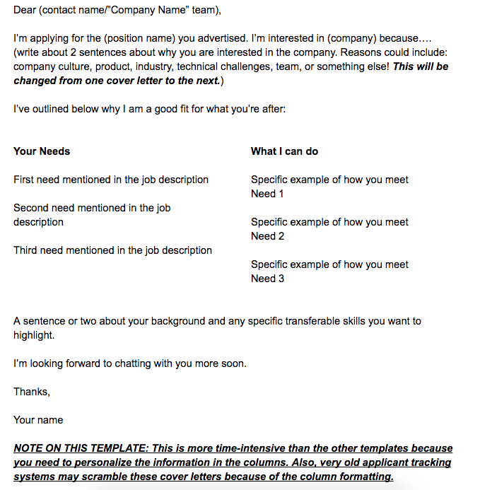
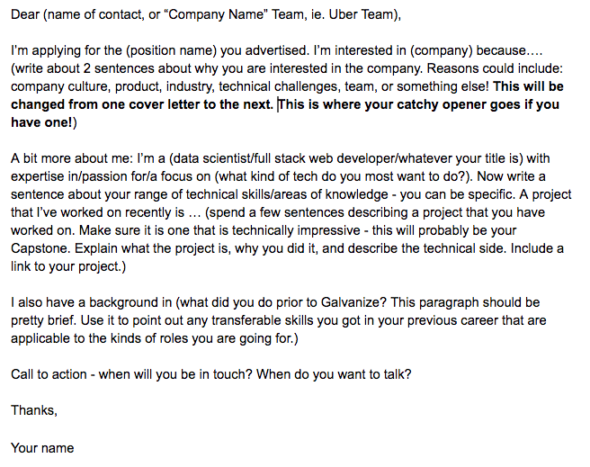
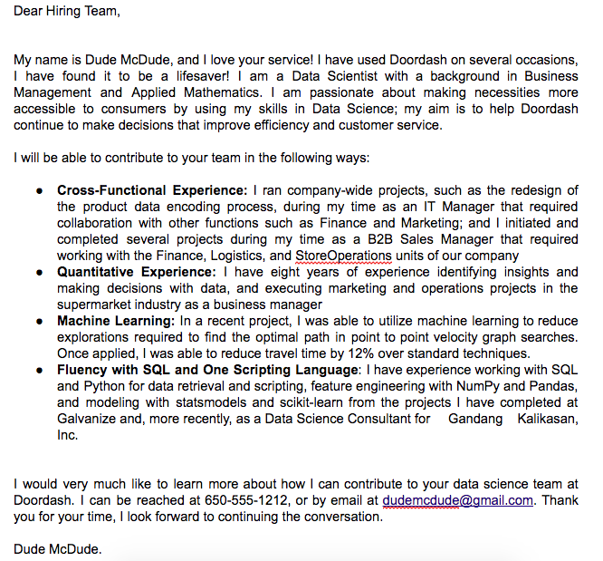
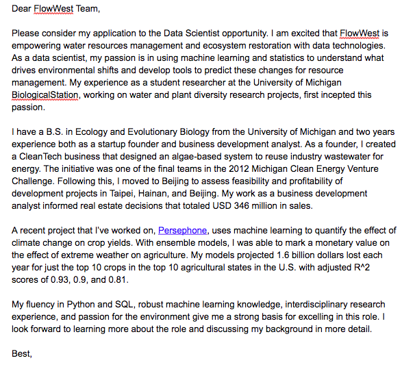

# Cover Letter Format

## Lesson Objective:
By the end of this lesson, you should be able to:
- Create a cover letter

## Rationale
- Knowing the key parts of a cover letter will allow you to put all the best principles we have discussed in previous lessons into an easy-to-read cover letter!

Now that you know some basic things to do and to avoid, let’s talk about a format that is easy to write - and for your audience to read.

### A great cover letter should try to hit the following four areas:

- Your anchor, and why you’re interested in the role and company
- Your background
- Why you’re a fit for the role and any accomplishments
- Sign off

Let’s break these areas down and see how they might come together in a cover letter:

- **Your anchor and why you’re interested:** *"I’m a Creative Front End Developer interested in the UI/UX position at Postmates. I think Postmates is awesome because X,Y,Z."*
- **Background:** *"A little about myself – I have bachelor's degrees in mathematics and over 2 years of experience working at Deloitte as an analytics consultant."*
- **Role fit:** *"My strong math background, fluency in JavaScript and SQL and client-facing experience give me a strong basis for excelling in this role. A project I’ve recently worked on is…"*
- **Sign off:** *"I’m looking forward to discussing the details of the role and how I could be a fit. Are you available next Tuesday for a call?"*

Notice that in this format, the **attention is first on the company.**

This is important because companies are so used to seeing generic cover letters that are not personalized. If you bury the company interest a couple paragraphs down, there is a good chance they will stop reading before they ever get there. 

After you talk about the company, turn the attention to yourself. This is your opportunity to talk about WHY you are a good fit for the position, the skills you possess that would help them out, and projects that illustrate your skills. Tie everything into what they do and who they are looking for. 

Finally, to sign off, reiterate your interest in the position and the company, and give a call to action to discuss the role. 

### Writing Cover Letters Quickly

You will soon be applying to a lot of jobs - and therefore you need to be able to write cover letters quickly!

Instead of starting from scratch for every cover letter, you should aim to make a foundational cover letter that you can keep mostly the same from role to role. After all, most things about your cover letter - such as your background, the skills that are most relevant to the kind of jobs you’re after, and descriptions of your work or projects - will not change. 

What WILL change is why you are interested in each company and role, and how your skills and experiences relate to each specific job. In the following exercise, you’ll create a cover letter for a specific job that’s of interest to you. Make sure, when you do it, that you keep in mind which parts of the cover letter you can quickly swap out when you’re writing a similar one for another company. 

### Cover Letter Templates

You can use the following templates to start forming your cover letter. Which template do you like better? Why?

-----------------------------------------------------------------------------------------------------------------------------

-----------------------------------------------------------------------------------------------------------------------------

### Example Cover Letters

Here are some sample cover letters. What do you like about them? What could be improved?

(Names have been removed or changed to protect the innocent.)

-----------------------------------------------------------------------------------------------------------------------------

-----------------------------------------------------------------------------------------------------------------------------

