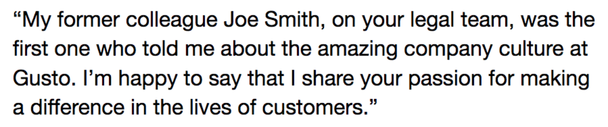
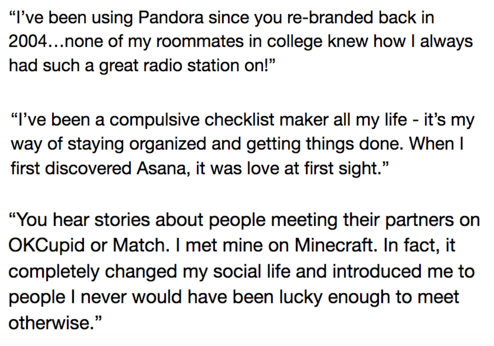
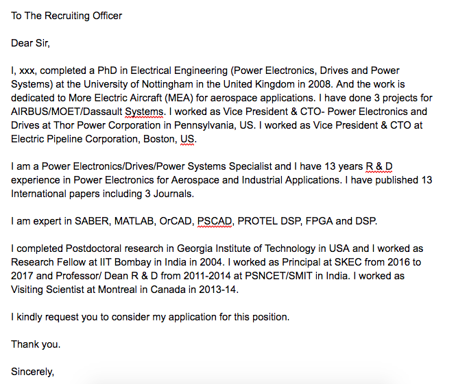

# Cover Letter Tips: Top DOs and DON’Ts

## Lesson Objective
By the end of this lesson, you will be able to:
- Distinguish between well-written cover letters and poorly written ones

## Rationale
- There are many ways a cover letter can help you, but a poorly written cover letter can also hurt you. Knowing the principles that make an effective cover letter will maximize your success. 

One of the main reasons that cover letters are going out of style is because so many people have been doing them so badly for such a long time. Use the following tips for content and style to make your cover letter stand out.

### DOs for CONTENT

- **Position yourself for the job you want, not the job you’ve had.** Just like with all our re-branding, always refer to yourself as a web developer or data scientist, and make sure to write your cover letter with that in mind! 
- **Highlight your most relevant experience - even if it’s not professional experience.** Going into detail on projects, such as your capstone, can make a big impact!
- **Address a specific person - or namedrop if possible!** Do you know someone who works at the company who has told you about the great culture? Have you done an informational interview with someone? Mention it!

- **Show your motivations.** Remember - your motivations for changing careers and coming to Galvanize are some of the most compelling things you can tell people. Putting these in your cover letter will help you stand out. 
- **Show what you would do for them - specifically.** Do your research! You can learn a lot from press releases, the company blog, websites like Glassdoor, and even a job description. Even better, when you do an informational interview prior to applying to a company, you will have insider knowledge about how you can benefit that specific company and address their specific pain points. 
- **Show why you are a culture fit.** Culture is becoming more and more important, and most companies proudly talk about their company cultures on their web sites. Talking about how you fit into a company’s culture creates a compelling argument for why you would be a good fit.
- **Differentiate!** How are you different to the other 300 applicants? Remember that competition is tough - especially in more crowded markets! When you read your cover letter, is there something that stands out to you? Is there something you would take away and remember? Or would it blend into a hundred other cover letters listing out degrees, technical languages, and credentials?
- **Use a human story or surprising fact as a hook.** Another great way to build a connection - and be memorable - is to tell a company how they have changed your life or made an impact on you.

- **Close with a call to action/follow up.** This is a powerful sales technique: end your note with a proposed specific date that you would like to reach out, or to follow up. Some examples: “Are you available next Tuesday to connect and chat about the front end position?” “I’ve attached my resume and am looking forward to hearing from you. I’ll follow up next Friday to see if you have any questions that I can answer!”

### DON’Ts for CONTENT

- **DON’T make it all about you - a little flattery goes a long way!** Nothing is more boring than reading several paragraphs about a stranger - and nothing is more interesting than reading about why people love you. Open your cover letters with a few sentences explaining exactly why you are excited by the company and the role. 
- **DON’T just repeat what is on your resume.** Obviously some of the content in your cover letter will be reflected on your resume, as well. But make sure your cover letter isn’t a basic walkthrough of your resume. Use it as an opportunity to add flavor and show why you are a great fit for this particular role. 
- **DON’T be vague.** Which is more compelling: “I built the back end of a group project,” or “I built a backend for a GitHub widget using the GitHub API and Oauth for user authentication, and also created a fully-tested Express server using GraphQL.”
- **DON’T focus on what YOU will get out of the role.** Unsurprisingly, nobody cares if this role will be a great move for your career, and how much you’re going to learn. Instead, focus on the benefit you’ll be adding to the company.
- **DON’T talk about salary/benefits.** For best results, these should always be left for discussion after an offer is made. Talking about them this early in the process at best makes you look like you are only focused on money, and at worst, will get you eliminated from the running in favor of cheaper candidates. 
- **DON’T include negative information.** Did you leave your last role because your boss was a jerk? Did you leave academia because of the poor job prospects? These things happen, but they don’t need to be in your cover letter. Don’t allow anyone’s first impression of you to be that you are a complainer. 
- **DON’T talk about age or excessively long experience unless it’s called for in the job description.** Ageism is a very real thing in the tech industry. Instead of focusing on experience that spans more than ten years, focus just on your experience that is most relevant to the role.
- **DON’T brand yourself as a bootcamp graduate - especially in competitive markets.** For example, the San Francisco market is flooded with bootcamp grads and it’s a turnoff for some people. Intrigue them with the cover letter, and leave Galvanize details for your resume. 

### DOs for STYLE

- **Keep a simple format with a familiar font.**
- **Be aware of white space.** A lot of text in dense paragraphs is difficult to read. Be respectful of the recruiter or hiring manager who has to read these things!
- **Keep it to less than one page - a couple paragraphs is ideal.**
- **Check your grammar and spelling.** 
- **Use a professional email address.** Ideal is something like: firstname.lastname@gmail.com. 
- **Use a relevant physical address, if appropriate.** Like your resume, if you need to put a location, put the one where the role is located (which may or may not be where you live!).
- **Match the tone of the job description (in general, in tech, casual is ok!).** If you are applying to a technical role in a bank, you will probably use a more formal tone. For most tech companies, large and small, a casual tone is preferred. 
- **Show, don’t tell!** Add hyperlinks. Don’t just tell me that you have experience - show me! Eyes will be drawn to hyperlinked text - if you can get someone to click through to your beautifully-written GitHub ReadMe, you have a good chance of getting a call!

### DON’Ts for STYLE

- **DON’T be stiff or formal (“To whom it may concern…”).** Again, in tech, casual is better. This kind of greeting will make you seem out of sync with modern culture. 
- **DON’T start every sentence and/or paragraph with “I”.** Look at the example cover letter below. Do you notice your eyes being drawn to the repetition of “I” - in a negative way? What other issues do you notice in this cover letter?

 

- **DON’T beg or grovel.** Always approach your potential employers as if you are equals, and as if you deserve their respect as much as they deserve yours. Begging is unattractive and people are less likely to want to hire you if they feel you are desperate. 
- **DON’T use cliches...unless you can back them up.** “Hard working”, “creative”, “rockstar”, “expert” -- all of these mean nothing, unless you can back them up. Save the space and instead talk about quantifiable results, impacts you made, and projects you worked on.
