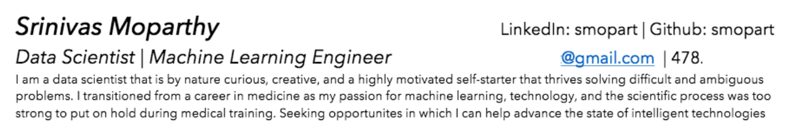
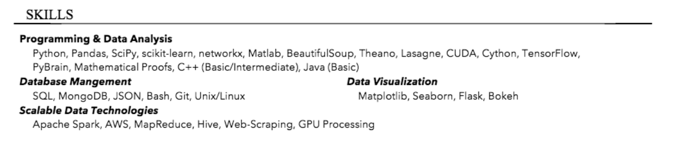
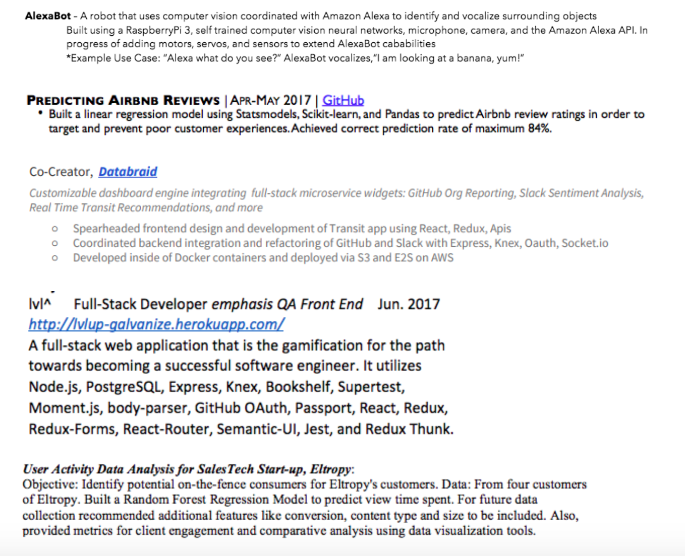
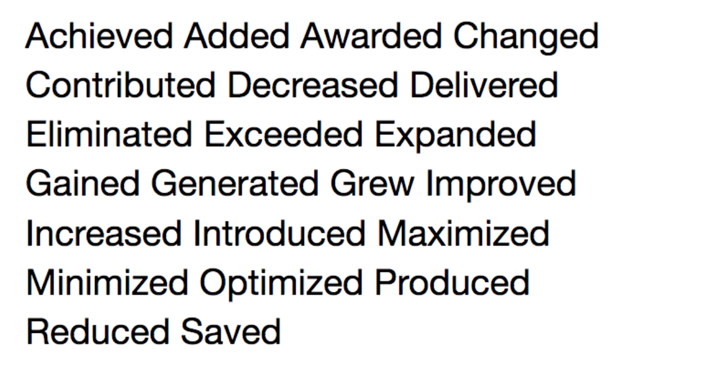
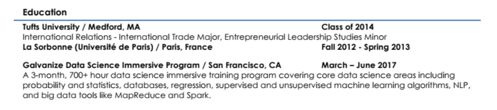

# Essential Resume Components

## Lesson Objectives:
- Be able to list the different parts a resume should include, and tell in which order they should be included on their resume
- Be able to explain how to structure a strong bullet point
- Begin crafting aesthetically-pleasing resumes suited to their career pivot

## Rationale
- Employers use resumes throughout the interview process: to screen out candidates, to understand how you might be able to add value to their team, and to guide questions during the interview process.
- Having an authentic, well-crafted, clear resume sets the foundation for a strong job search- how you use that resume and assuring you are applying to the right positions with that resume - is for another topic
 
 
 
 

The following sections are necessary components of a strong resume. Edit your resume to include the following.

### Header

The header of your resume should include:

* **The first and last name that you are known by.** For example, if your friends and coworkers call you by your middle name instead of your first name, use your middle name on your resume (and online social media). Save your legal name for legal paperwork. 

* **Your anchor.** This is one of the best ways to make it glaringly obvious what you do and how you are looking to add value. Put this right after your name. For example: **Camila Nawaz, M.Sc., Data Scientist**

* **The city and state where you are applying for jobs.** This may not be the city you’re currently located in! If you are considering several different cities, make different versions of your resume. If you do not have the correct city on your resume, many hiring managers will automatically not consider you for roles. When you get on the phone with a recruiter, you can explain that you are planning to relocate. For example, “Seattle, WA.” Don’t include your entire mailing address - nobody needs to know exactly where you live.

* **Your phone number.** (Remember to include the area code!)

* **Your email address.** Your email address should be professional, and ideally should follow the a format similar to firstname.lastname@gmail.com. If your email address ends with yahoo.com, aol.com, or hotmail.com - you may want to consider upgrading to something that looks less old-fashioned.

* **A URL to your GitHub profile and LinkedIn profile,** and other web sites as appropriate (professional Twitter account, personal web site, etc.). To save room, you can also just use words with hyperlinks - such as LinkedIn. (Remember, most people won’t bother to actually type in a web address - they just want to click on a link!) Be sure to remove bulky, unnecessary characters from the URL; for example, instead of listing “http://mywebsite.com,: list only “mywebsite.com.”

 
 
### Summary

Your summary comes next.

Here’s how you can determine if you need to have a summary on your resume: When looking at the past experience listed on your resume, is it immediately obvious that you’re a web developer/data scientist? **If not, you need a summary to make this clear to employers.**

In your summary, include your current/aspiring profession, and your prior professional experience or education. That way, the employer immediately knows what you are (and what to do with you) and is able to quickly make sense of your diverse background. For example: “Front-end web developer with a full-stack education and a background in graphic design” or “Data scientist with a PhD in physics, and 10 years of experience in a research lab analyzing big data.” 

Your summary should be only 1-3 lines. 

It should be a summary of yourself, rather than an objective, as objectives tend to sound demanding (not a great posture to have before an employer wants to hire you). For example, an objective might say, *“Data analyst who is seeking a position on a team of driven people,”* but a summary would phrase the same desire as *“Data analyst who enjoys working with driven people.”* The former is pushy, the latter shows personality.

If there are any areas of special interest that you are looking to pursue (such as front end engineering, or NLP), or any specific industries (passion for consumer products, special interest in artificial intelligence), you can add these to your summary.
 
 
Here is a great example of a summary:

*Data Scientist with a background in digital media, corporate social responsibility, international
development, and gender equality. Skilled researcher with experience in machine learning algorithms, data processing tools, and statistical models. Earnestly enjoys asking creative questions of data and gleaning actionable insights.*

Here is an example of a full header with summary:

 
 
### Skills

Next comes the skills sections of your resume. This is where you get to quickly showcase the technical languages and skills you have acquired, used, and mastered. **You order your technical skills by your level of proficiency.** For example, if you have been working in Angular.js for a while and have recently been introduced to React.js, you would list Angular.js near the beginning and React.js near the end; the employer can expect you to answer more advanced Angular.js questions.

Notice that your skills section **only includes technical skills.** Soft skills like leadership or communication or functional skills like project management or marketing can be woven into your experience section. And **do not include common skills, like Microsoft Word.** These common technical skills do not distinguish you from other candidates, and can actually have a negative effect in how you are perceived because they are so basic.

As well, don’t include skills that are not relevant to the job that you’re applying for. Remember: your resume is a document that tells an employer everything that you can do for them, not a document that says everything that you have ever done and can do. 

If you have extra room, you may also choose to list your skills in relevant groups:

 
 
### Projects

Now to the sections that offer proof of your technical skills: your projects, experience, and education. Data science students - you can also include your case studies in this section of your resume! You may also - and we encourage you to do so! - work on a project outside of class, using your technical skills on a project related to your industry focus or personal passion. As you complete them, you can add projects throughout your Galvanize experience, following the below guidelines. 

For each entry in your projects section, include the following:

* **Your project’s title.**

* A **link** to the project’s website or GitHub README. 

* A **1- or 2-line description of your project.** In a few words, how would you describe your project to a stranger? For example, “Mobile app that serves as a pay-it-forward Kickstarter between local communities and local small businesses” or “Model that detects user fraud for healthcare companies monitoring their clients’ physical activity.”

* The **technologies that you used** to develop your project; this is where you show that you have used the skills that you listed in your skills section. For example, “... built using HTML, CSS, and ReactJS.” 

* Your **personal contributions** to the project. If your project was built on a team, say what you personally contributed. For example, “personally designed and implemented the front end” or “acted as backend developer and project manager.”

 
Because your resume should only be one page, there will come a time when you have completed more projects than you can fit on your resume; when this happens, keep only your most impressive projects on your resume, as many as you can fit, and retitle the section “Sample Projects,” “Select Projects,” or “Recent Projects,” depending on what you like best and what’s most appropriate.

Here are some examples of project descriptions:

 
 

### Experience

Now we get into the meat of the work that you have done, and your accomplishments. For most Galvanize students, your Experience section is likely to be the lengthiest - second to the Projects section as you approach graduation - and is often the most difficult to both create and refine. It’s hard to distill your own experience, but that distillation is critical. Remember those six seconds that a recruiter or reader spends on your resume; you want to make every second of that count, and assure they are pulling exactly what you want them to pull from your experience. 

Your experience is also **not your job description** - it’s what you brought to that job description, and accomplished within that job, and why it is significant. Highlight your work using facts, not adjectives. 

 
The title bar to each entry in your experience section should include: 

* **Your job title** (if you had multiple titles while working at this company, you can list them as different entries). When creating an experience entry, make sure that your title is the thing that’s listed first and in bold—not your company’s name. Employers are more interested in what you can do than who you worked for. 
* The **formal, full name of the company** (you can add abbreviations or common names in parenthesis). For example, if you worked for the video game company EA, you can list the employer as Electronic Arts Inc. (EA) 

* If you have room, add the **city and state** in which you worked while at that job

* The **dates during which you were employed** at that job. Use the format Date, Month. Avoid just using years - this is a red flag to recruiters that you are trying to hide unemployment gaps on your resume. (If you do have unemployment gaps, that’s ok - it happens! If you try to hide them, they will look more suspicious than they probably are. Make an appointment with your Career Services Manager to discuss how to talk about these gaps.)
 
 

Below the title bar for each of your experiences, you will included a bulleted list of your relevant accomplishments while working at that job, starting each bullet point with an action/success verb, the subject, and the result. Emphasize anything technical or analytical. Also use metrics wherever possible to quantify your successes.

Commonly used success verbs, care of The Ladders, include:

Make it relevant. Don’t include details about all of your prior experience, only the items that will matter to and impress future employers.

If your past work experience isn’t immediately transferable to the position that you’re transitioning to, consider the responsibilities of your past work that are transferrable, for example, leading/managing a team, project management, improving efficiency, effective communication, and so on.

For example, if you were applying for a position in software development but had prior experience as a barista, it would be useful for a potential employer to see that you had experience working on or leading a team...but it wouldn’t be useful for them to know that you are skilled at latte foam art. Use that example of a guide for your own career pivot.

Always include the most relevant and most impressive information in the first bullet point. It is most likely to get read in that 6-second skim!

 
 
**Great Bullet Points**

If you’re feeling stuck, follow this format. A great bullet point should contain the following info:

* **What?** Answers the question “what happened?”

* **How?** Answering the questions “How did it happen? in what way? with what tools, methods, processes?”

* **So What?** Why do I care? What was the impact? How did this affect the business?
 
 

Look at the two examples below. Which bullet point is better? Why?
 
 
* *“Analyzed and reported system data to stakeholders”*

* *“Brought clarity to progress towards company goal by providing a detailed monthly report and analysis of each department’s contributions which contributed to beating revenue goals by 2% in 2014.”*

 
 
### Use a Grounding Statement

Some people feel that their experience can’t be understood without some context. If this is the case, you can use a grounding statement - a one-line, high-level description of your previous company’s goals and your role.

Here is an example of an experience entry with a grounding statement. Look at the bullet points. Which point is highest-impact? Which point is weakest? Why?
 
 

**Software Expert, Group Innovation & Incubation			Sep 2012 – May 2015**
**Nagra Kudelski Group**							

*Responsible for future technology & application advancements within an agile R&D Innovation Group*
* Initiated proposals per Intellectual Property (IP), creation of patents, and formation of new business units
* Successfully executed special project research technology directives to assess portfolio value-add
* Formulated new strategic partner vendor relationships to strengthen Digital TV and Public Access sectors
* Led Proof of Concept (POC) designs centered on long-range distance detection, achieving similar results to Active RFID via a disposable low cost Battery-Assisted Passive (BAP) RFID design

 
 
### Education

For each of your education entries, include the name of the school that you attended and the abbreviation of the correctly punctuated degree that you earned (for example: M.B.A., B.A., B.S., Ph.D., Ed.D., M.S., M.A.), as well as the subject in which you majored.

**Top tip:** If your work experience is limited or less relevant to your new career, but you took some relevant college courses (that may or may not be reflected in the name of your college degree), feel free to list out the courses! This can add to your technical credibility.
 

**University of Notre Dame: BS Social Science**

*Courses included: Intro to Python, Intro to Java, Java - OOP, Java - Algorithms & Data Structures*

 
If you studied at a school but did not obtain a degree, you can still list this experience on your resume, just don’t include a degree. For example: 
 

**University of Washington: Computer Science**

 
Note that you **DO NOT need to list the graduation year.** In fact, some employers prefer this because it helps them avoid age bias.

Also, only include your GPA if it is very impressive (3.7+), and you graduated within the last year. If you have several years of work experience, including your GPA adds nothing, and can sometimes even make it look like you are living in the past.

If you are including Galvanize under “Education”, you can still write a description of the course to help employers understand what you have done. Here is an example of Galvanize included in the “Education” section:

 
 
### Other Sections

If you have other relevant information that you want an employer to see, you can create an additional section to house it. For example, if you received an award at a hackathon, you volunteer at one of the local data science meetups, or have noteworthy publications.

Simply name the section what makes the most sense, e.g. “Awards,” “Publication,” “Patents,” or “Volunteer Experience.” 

Only have a section that includes hobbies if your hobbies are directly related to your future career, or if they are so unique that they will be good conversation starters.

For example, if you are targeting only wellness companies and you run a Wellness Through Yoga group, it would be relevant to add. If you are only targeting AI and robotics companies, and you a fixture in a local robotics group, include it.

One former student was able to start many conversations by including on his resume that he enjoys baking bread and playing the ukulele. However, his resume was also extremely strong without this additional information. If your hobbies are more standard, like walking your dog and playing soccer, don’t include them.
