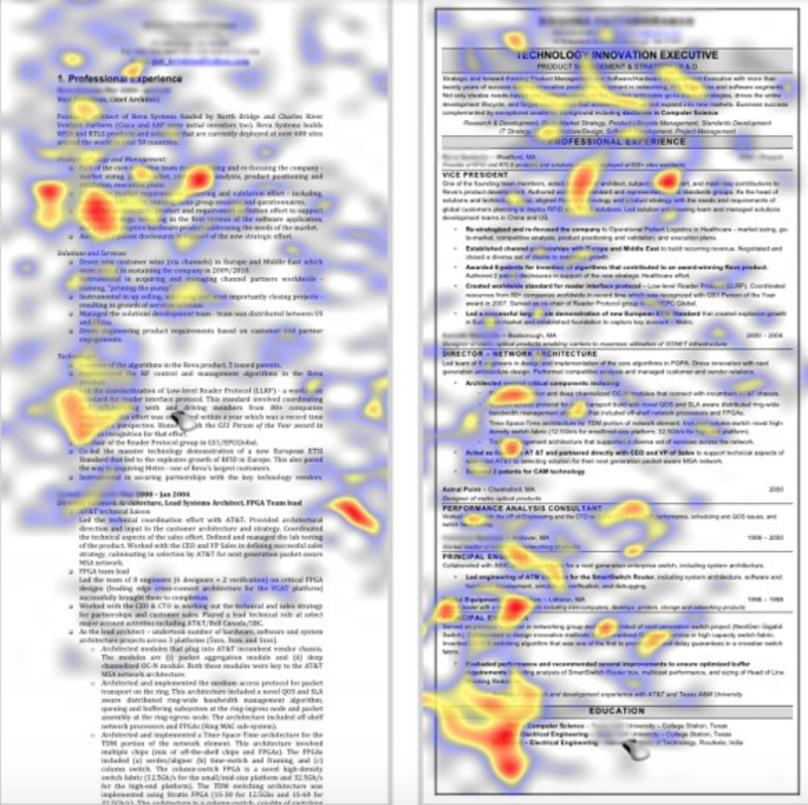

# Resume Styling and Format

## Lesson Objective: 
- Create a resume with compelling style

## Rationale
- A clear, concise resume is critical. According to a study by The Ladders in 2011 that tracked eye movement of 30 recruiters over a 10-week period, resumes get an average of six seconds of attention 

 
 

Before we get into your resume content, you need the reader to want to read that content. Creating an aesthetically pleasing resume assures that a potential employer is drawn into your skills and experience, versus fancy fonts or complicated styling. A 2011 study from The Ladders on recruiter decision making followed the eye patterns of 30 recruiters over a ten-week period. 

The results are below. 

What do you notice about the eye tracking results for the resume on the left? How about for the resume on the right?

What stylistic differences do you notice in the resumes that account for this?

Use the following guidelines to create a resume that is easy to read - even in 6 seconds!

* **Keep your resume to one page.** The exceptions to this: 1) if you have over 15 years of relevant experience you may use 2 pages; 2) if you have a PhD and a background in academia, and are planning to pursue an academic or science-based position, you may use an academia-style CV instead of a resume. Consult your Career Services Manager for additional guidelines if this applies to you. 

* **Put the most important information in the top half of the page.** Almost nobody uses paper resumes anymore. Imagine opening your resume on a computer screen. If the top half is not compelling, nobody will scroll to read the bottom half. 

* **Margins must be standard** (i.e., the same around all sides) and your font size should be 10 or 11 pt.

* **Choose one typeface that is classic and readable**, like Arial, Baskerville, Didot, Georgia, Helvetica, or Times New Roman.

* **Font color should be black.**

* Each section of your resume must be **clearly labeled.** If an employer glances at your resume, they should be able to easily locate your education, your skills, your experience, and your technical projects.

* Within the main sections - projects, experience, education - entries should be **ordered in reverse-chronological order.** The most recent experience should be at the top.

* When writing dates, **use a Month, Year format.** Stay consistent with how you do so - if you write out the full month in one area, don’t abbreviate in other areas.

* Also **stay consistent with punctuation.** If you end some bullet points with periods, do so on all bullet points.
