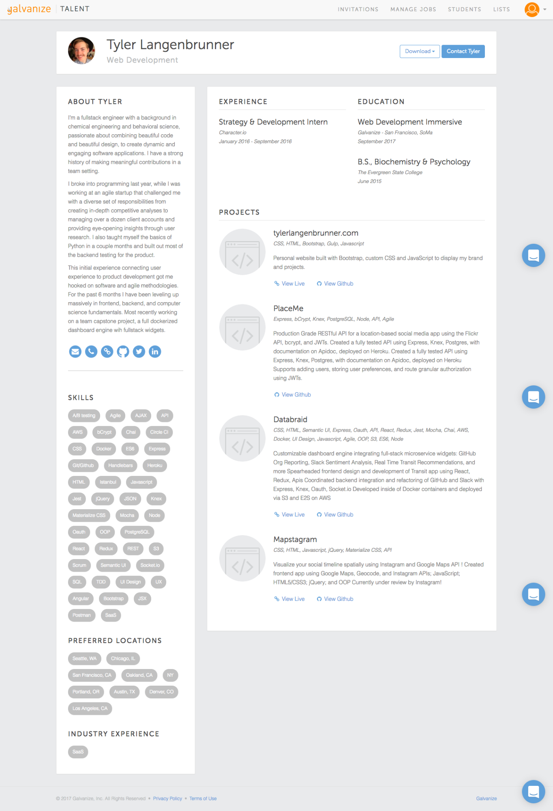
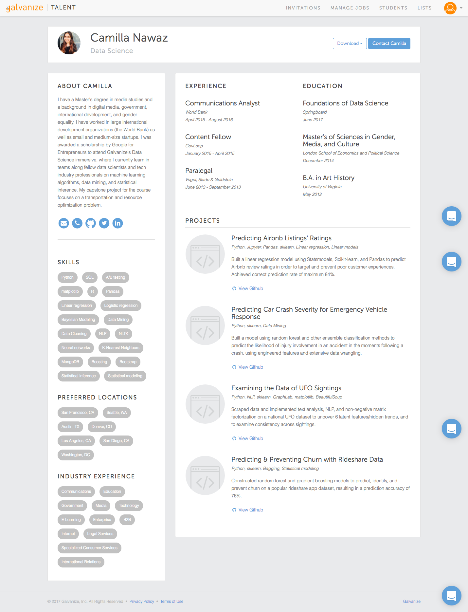

# Your Talent Profile

## Objectives:

By the end of this lesson, students should complete their Talent profiles.

## Rationale:

Talent (talent.galvanize.com) is Galvanize's proprietary hiring platform, showcasing our data science and web development students from across all of our campuses, and inviting employers to connect with that talent. As a Galvanize student student ready to launch your new career, Galvanize Talent is your tool through which you market yourself and your skills, all under the Galvanize umbrella.

### Why Talent?

In Unit 6, you learned what Talent is all about - it’s your “one-stop” site where you can browse jobs that have been specifically sourced for Galvanize students, and our hiring partners can see your profiles. 

To have a complete profile in Talent - meaning a profile that is ready-for-primetime and viewable by potential employers, you must have the following: 

- Headshot/Profile image
- About Me (the Talent version of the biography)
- At least one entry in Education (Galvanize = one!) 
- At least one role listed in Experience
- LinkedIn URL
- GitHub URL
- At least one technical Project

When you are first creating your account, you may not have a lot of projects. For Data Science, you can add your case studies to this section. WDI students should be able to add their Q1 projects. 

### Creating Your Talent Account

On the first day of your cohort, you received an invitation email with the subject: “Welcome to Galvanize (Your First Name)!”. This email is sent to the email address associated to your main Galvanize account - so the one with which you applied to Galvanize. 

Once you have created your  “Galvanize Account”, you now have access to the Members Portal (members.galvanize.com) and (students.galvanize.com). You will see a “Thank You” page allowing you to navigate to either site. Click into Talent (talent.galvanize.com), and you will need to click the “Sign In” link to create a profile. 

### Creating Your Profile

And to assure your online brand is consistent, you can important for information from LinkedIn. You spent time on your LinkedIn profile already - use this for Talent! Click onto your LinkedIn Profile and next to the “View profile as” button, hover over the arrow to reveal the Save to PDF (image below). This is the file that you can upload into Talent, and augment with any additional information - including your headshot - to assure your profile is complete.

Your Talent bio can also be different to your LinkedIn biography. A great Talent bio should be a couple of paragraphs long, and should include your story: your background, why you decided to move into data science or web development, what you know, and what you would like to use with that knowledge.

These biographies will also be visible to employer partners at your capstone showcases - so make sure you are representing yourself the way you want to be seen by potential employers!

Other parts of your Talent profile include:

Your photo. Make sure it is professional. You may use the same one that you have used for your LinkedIn profile.
- **Skills.** Search for all the skills that you either learned at Galvanize, will learn at Galvanize, or that you know from prior to Galvanize.
- **Contact information.** Add as much contact information as you can, including: email address, phone number, your personal website, GitHub, professional Twitter, and LinkedIn.
- **Preferred Locations.** Add up to 10 preferred locations. If you do many more than this, it can mess with Talent’s algorithms that present jobs in those locations. You will find the most opportunities in areas with Galvanize campuses (San Francisco, Seattle, Denver, Boulder, Phoenix, Austin, and New York). Other good locations to add are major or growing tech hubs (Chicago, Des Moines, etc.). Employers will search for you based on your preferred locations, and these will also determine the recommended jobs that are shown to you. You can update these whenever you want to.
- **Industry experience.** Include only industries where you already have experience, either through work, volunteering, or education.
- **Experience.** Add job titles, company names, and dates. Use your LinkedIn or resume as a guide.
- **Education.** You must have something in this field in order to publish. Include your Galvanize immersive program along with other degrees that you have obtained. 
- **Projects.** Projects must link to GitHub and should include a paragraph of description - like a mini ReadMe - to help employers understand more about the project.
- **Resume.** Upload your completed resume.

Here is an example of a great web development Talent profile:

Here is an example of a great Data Science Talent profile:

### Talent Pro-Tips:

- **Hiding/Publishing Your Profile:** once you’ve completed your profile, you have the option to “hide” your profile by toggling the button in the top right corner. Companies cannot view your profile or contact you when your profile is hidden. All profiles must be published by the beginning of Q4; once you have confirmed employment, your profile will move to unpublished (you are off the market!). 
- **Managing your jobs:** When you archive a job by clicking the trashcan icon, that job goes to the “Archived” folder. Use this feature sparingly: you cannot apply to that position once it has been archived! 
- **Matchmaking/Recommendations:** once you have completed your Profile, the Career Services team will be able to recommend positions (with our commentary) directly to you via Talent. You can then apply to these positions or discard them. Once you’ve been matched to a role, Hiring Partners can reach out to you directly.
- **Our hiring partners can find you!** Once you have completed your profile, Talent can begin recommending jobs to you, and Talent can share (recommend) your profile with prospective employers. Hiring Partners with access to Talent can filter and sort students by their current location, preferred location, and graduation date.

