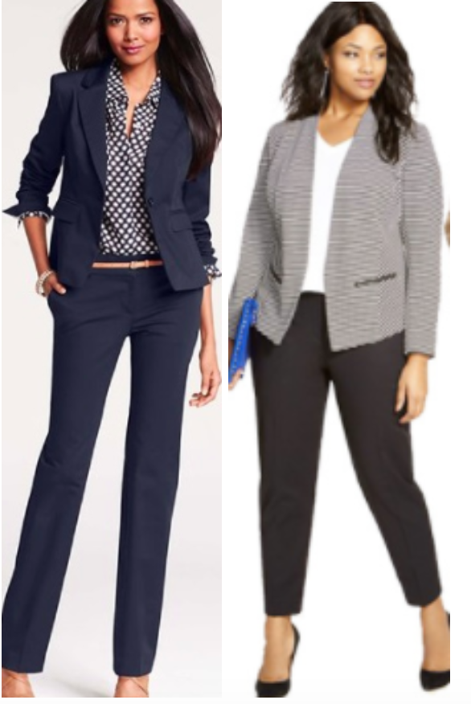
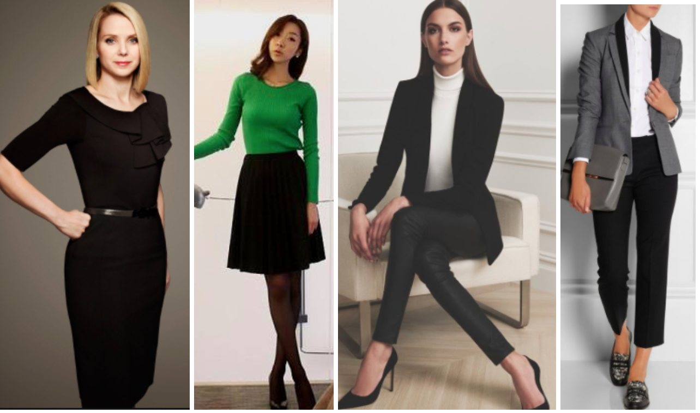
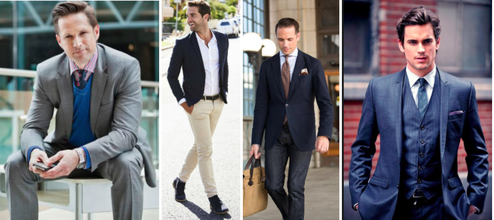
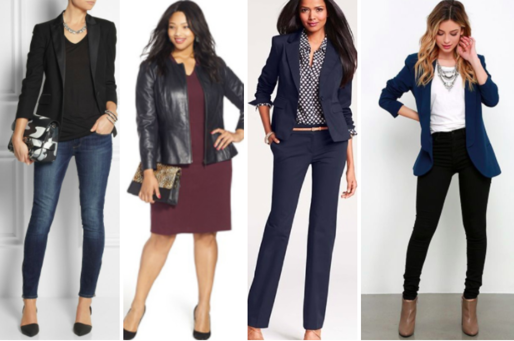

# Interviewing Basics

## Objectives: 
By the end of this lesson, you will be able to:
 - Explain how to dress in different interview situations
 - Know what to bring to an interview

## Rationale: 
How you present yourself in an interview is going to be a big part of the first impression you make. It’s important to understand how to dress and appear to portray yourself in a positive light. 

### What to Wear

Research the Company: Dress to the Culture and the Role

The first step in deciding what to wear to an interview involves doing some research on the company and the role you’re interviewing for. 

As a general rule, you want to look slightly better and more formal than the people who are interviewing you. In many parts of the country, tech offices are very casual. People show up to work in jeans and t-shirts. However, that doesn’t mean that you should show up to the interview that way! For example, if the company you are interviewing at is usually in jeans and t-shirts, you should dress in smart jeans and a button-down shirt. If they are dressing in khakis and button-down shirts, you should add a tie, blazer, and nice shoes.

To determine what the company culture is like, you can do the following:

* Ask yourself: is this a more traditional industry, or a more modern one? For example, if you are going for a tech role at a bank, you should expect to dress to the culture of the financial industry, which is much more formal. If you are interviewing at a startup, you should expect a much more informal setting.
* Ask yourself: how large and corporate is the company? Many times (though not always - Facebook and Google being good exceptions!) larger companies will have a more formal dress code. For example, you will see more people dressed in business casual clothing at Salesforce than you will at a small startup.
* Research the company: Go on the company web site. Many companies will have a team page or a blog page - and on these pages, you can often find images of people in the company. How are they dressed? Remember, you want to be one step above them.
* Research your interviewers: A good place to start is LinkedIn. A person’s LinkedIn profile will often show you what that person thinks of as business appropriate attire. 
* Ask your recruiter: It’s totally ok and normal to ask your recruiter what the normal attire is for interviews. Unfortunately, the answer won’t always be useful. Especially in tech, many recruiters will tell you: “Just come in whatever you feel comfortable in!”
* Ask your contacts: Do you know anyone who works at the company, or have friends of friends who know people? Reach out and do some research.
* Do some light stalking: If you live or work near the company, try seeing what people look like as they go in and out of the building. This is the best way to get a real idea of what people are wearing at the company, and may also clue you into fashion biases that the company may have. For example, we have seen some hiring partners (mostly in the fashion industry) who tend to only extend offers to stylishly-dressed women, while male candidates are allowed to dress much more casually without detriment.
* Understand the level of your role and its primary function - is it mostly computer-facing work, or people-facing work? In general, the more senior your role is, the more dressed up you should be. Also, the more you will be expected to interact with people (media, clients, etc.), the more presentable you should be. In the more senior levels, gender bias exists: men can dress far more casually than women.

### Computer-facing Roles

**Senior Roles**
* Roles such as: Sr. Data Scientist or Software engineer; software engineering manager; data science manager; leading a team;
* Dress code is one step closer to the business side of “business casual”. On the job, you will probably still wear jeans, but may pair them with a button-down shirt or blouse.
* In the interview, dress one step better: well-tailored pants, blouse or button-down shirt; blazer
* Stylistically, err of the side of practical

  

  
**Less Senior Roles**

* Roles such as: Data analyst, data scientist, ML engineer, data engineer, web developer, software engineer
* Dress code is more casual. On the job, you’ll likely wear jeans, t-shirts, hoodies.
* In the interview, dress casually: khakis, nice jeans, ballet flats, non-pencil skirts, jersey dresses, etc.
  

  

  
### People Facing Roles

**Senior Roles**
* Any role where you may outwardly represent the company or the team. CTO, Sr. managers, head of data science, etc.
* On the job you will range from smart business casual to business wear
* In the interview, more traditional business attire is preferred: a smart suit, tie, smart dress and blazer, heels for a larger company
* At this level, men can get away with being more casual than women can.

  

  

**Less Senior Roles**
* Roles such as: technical evangelist, data science marketer, sales engineer, etc.
* Dress code is one step closer to the business side of “business casual”. On the job, you will probably still wear jeans, but may pair them with a button-down shirt or blouse.
* In the interview, dress one step better: well-tailored pants, blouse or button-down shirt; blazer

  

    

### Make Sure it is Comfortable

When choosing your outfit, make sure that it is physically comfortable and that you feel good in it. The last thing you want is for your outfit to affect your interview performance - for example, can you imagine how distracting it would be to have to continually pull down your skirt while whiteboarding, because you’re not sure if it’s too short?

Make sure that your outfit does not restrict your range of motion, make you too hot (or leave you cold), and that it doesn’t require much adjustment. Feeling confident in your outfit will help you feel more confident throughout the entire interview experience.

### Be Properly Tailored

Good tailoring is one of the easiest ways to look good in your outfit. Sleeves and pant legs that are too long or too short will throw off the entire look of your outfit. 

### Show Some Personality

It’s often ok to show off some personality - especially at more casual tech startups. Many people successfully interview with tattoos showing, hair dyed creative colors, or less-traditional piercings. 

Women have to be most careful here, though, because of a double standard. If women wear too much makeup or jewelry, they are often viewed as high-maintenance by the mostly-male interviewing panels. 

### Wear a Watch

It will help you keep track of time, which can also help you know how the interview is going - and it’s much less awkward than having to pull out your phone whenever you want to check what time it is.

### Wear Layers

A cardigan, blazer, or scarf can keep you from getting distracted by the cold.

### Contacts and Glasses

If you wear contacts, it’s a good idea to bring along your glasses, as well - just in case. It would be a shame to be distracted during whiteboarding because your contacts dry out or one falls out of your eye.

### Hair and Grooming

For men and women, make sure your hair is clean, dry, and does not have visible dandruff. If you have longer hair, it’s a good idea to tie it back - especially for men. If you have bangs, style them to stay out of your eyes. 

Avoid using excessive amounts of visible hair product. 

Make sure you smell clean, but avoid using a lot of perfume - it can trigger allergies or migraines in some people. 

### Keep it Non-offensive

This isn’t the time or place to wear obviously branded products, or shirts with slogans or phrases on them. 

### For Men

For men, standard tech interviewing attire includes:

* A button-down, collared, long-sleeved shirt - often NOT tucked in. If it is tucked in, have a belt.
* A pair of very nice, well-fitted jeans (usually a dark wash) or non-denim pants (such as khakis)
* A pair of loafers, or a NICE pair of low-top sneakers (like Vans, Converse, or higher-end)
* A light-weight, casual but structured jacket, or an unstructured blazer, or a cardigan

### For Women

* A blouse or button-down shirt, usually not tucked in
* Nice jeans (that aren’t too tight) or well-tailored non-denim pants
* A mostly unstructured dress, such as a shirt dress or tunic dress, belted (make sure any dresses are not tight or sexy, and always wear tights)
* A cardigan, jacket, blazer, unstructured blazer, and/or a scarf
* Boots or ballet flats (avoid heels except for fashion companies and senior-level positions)
* Some small jewelry - avoid anything too large
* “Natural” makeup

### What NOT to Wear

Avoid the following items:

* Hoodies
* Athleisure
* Branded items/items with words (especially if they are meant to be clever
* Ripped jeans or pants
* Baggy/loose fit/relaxed fit jeans or pants
* High heels
* Heavy makeup (if the average non-makeup-wearing person can tell you’re wearing makeup, it’s probably too much)
* Lots of hair product (especially for men)
* Overly-styled hair (especially for women) 
* T-shirts and short-sleeved shirts (for men)
* Statement jewelry
* Open-toed shoes or sandals
* Tennis shoes/running shoes
* Anything that shows your underwear
* See-through tops (intentional or not)
* Clothes that are too tight
* A full suit or business dress, unless you’re going for a senior, people-facing role.
* Hats or headgear (unless it’s for religious or medical purposes)
* Sunglasses

### What to Bring

After you’ve gotten your outfit picked out, make sure you have these items ready to go for your interview:

* Your laptop computer unless you are expressly asked to not bring one. Some companies with high security concerns will not want your personal laptops on site. If live coding is part of the interview process, they will provide you with a computer. Otherwise, your best bet is to bring your own laptop. If it’s needed, you’ll feel more comfortable having the option of the environment you’re most used to.
* Enough paper copies of your resume for everyone you’re going to meet, plus one for yourself. The reality is that nowadays, most interviewers won’t be using a paper copy -- but you always want to be prepared for those who do! Having an additional copy for yourself is important in case you are asked to walk someone through your resume and you want it in front of you for reference.
* A pad of paper and a pen or pencil. Though you will have your laptop with you, pen and paper is still the preferred method for taking notes during an interview for one big reason: sitting behind a screen creates a sense of distance between you and your interviewer that a pad of paper does not. This is also where you can have some good notes that you bring into the interview - such as a list of questions that you want to remember to ask each person that you meet.
* A bottle of water and a snack. Most places will offer these to you - but in case they don’t come prepared! There is nothing worse than trying to make it through an interview with your stomach audibly rumbling. 

### What to Prep

In the next lessons you’ll be learning in more detail how to prep for your interviews. For now, make sure you have these basics down:

* Know how long it will take you to get to your interview, and know how you are going to get there. Is there public transportation? How early will you have to leave to have some buffer time in case of a delay or missed connection? If you are driving, GoogleMap it at the right time of day so you know how to account for traffic. Also, check out the parking situation nearby.
* Have questions prepared in advance to ask each of your interviewers - both about themselves and about the company. You’ll get more information about this in Lesson 2.
* Prepare to talk about yourself and answer common soft skill interview questions. We will go over these in Lesson 4.
* Prepare for your technical interviews! You will learn more about these in Lessons 6 - 8.

