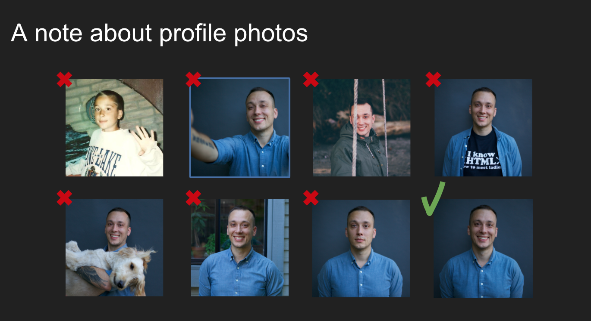

# Brand Yourself on LinkedIn

## Pre-requisites: 
If you do not already have a LinkedIn account, create one now.
 
 

## Lesson Objectives:
By the end of this lesson, you will be able to:
* Craft a LinkedIn summary that catches attention and tells your story
* Update your LinkedIn profile to reflect your career transition
 
 

## Rationale:

Most recruiters perform social recruiting during the job hunt, and LinkedIn is the #1 site where people will go to learn more about you and your professional life. You will also be using LinkedIn extensively in the coming weeks and months to continue to build your online brand, and to build your network - so it’s important to update it now so that it will serve you well!
 
 

### Understand the Industry

As a career changer, you are entering a new industry - and it’s important that your LinkedIn profile reflects your new career path. Recruiters and hiring managers use LinkedIn mostly with basic boolean searches (and through more advanced search tools, if they pay for the privilege!). 

Therefore, it’s important that your profile has enough of the kind of content that other people in your new industry have, so that you will be more searchable and recognizable.

Take 5 - 10 minutes to go to LinkedIn, and in the search bar, look for “web developer”, "software engineer” or "data scientist". Take note - what kind of key terms and phrases do you see in their profiles? What stands out to you in a positive way? What do you think recruiters and hiring managers notice when they see these individuals’ profiles?

Keep these things in mind as you work through the next sections and build out your profile!
 

### Your LinkedIn Name

Make sure this is the name you use across all platforms and materials. If you go by a nickname, make sure you are searchable across all mediums. I.e. Don’t go by James on the resume, Jim on Linkedin, Jimmy on Github, Jamie on Talent. Pick one and stick with it. This is your brand. 

Also, remember that you do not need to go by your full name - especially if it is long. First name (that people commonly call you by) and last name is preferred. 

Remember: You do not need to use your legal name, if you more frequently go by a nickname. Use your legal name when it’s time to sign an employment contract. Otherwise - on LinkedIn, other web sites, and your resume - use your nickname!
 

### Location

Update your location to wherever you are looking for job - which may or may not be where you are physically located! Many people will automatically disqualify you for jobs if they think you are not local.
 

### Headshot

Your profile photo should be employer-friendly and professional. This means that adheres to the following criteria: 

* It is recent. Your photo should portray how you look today—not how you looked when you were younger or in better shape. If you change your look often (e.g. hair), you may need to update your photo regularly. 
* It features only you. There shouldn’t be pets or other people in your photo. 
* It has a clean background, and you are in focus. Either you are the only subject in the photo against a clean background, or you are in focus and the background is blurred.
* It it high-quality. The photo should be in focus and well lit. (No selfies or cell phone photos!)
* It is professional. You should be wearing clothing that is appropriate to interview in for your desired role (not too formal or informal). Save hiking or wedding photos for Facebook. Also save artsy black and white or filtered photos for Facebook.
* It is friendly. You should be smiling in your photo. Employers don’t want you to be “attractive” or “cool”; they want you to be kind and professional, someone who looks like they will represent their company well and be fun to work with. 
 

### Headline

If a recruiter is going to spend even two seconds on your LinkedIn profile, they are likely on your Header. This is your announcement to your network - and potential network - that you are a Software Developer or Data Scientist. No need to put qualifiers like aspiring or in-training - this is your chance to brand yourself as you are the minute you start Day One at Galvanize. 
 

### Industry

The industry list on LinkedIn is a mix of functions/roles and industries. While you may end up targeting a specific industry like Retail or Energy, while you are in the Galvanize program, denote “Computer Software” as your industry. This signals to employers your immersion into the technical community, and allows you to transfer those skills to your future industry, should you get more specific. 
 

### Your LinkedIn Summary

In the previous lesson and exercise, you started brainstorming the content of your online profiles. It’s now time to craft that into a full summary for LinkedIn!

LinkedIn considers itself a “story-telling platform”, and therefore allows more space (up to 2000 characters!) than many other sites to talk about yourself. This is one of the first things that recruiters and hiring managers will look at when they visit your page, and it’s your opportunity to differentiate yourself - and impress them. 

There are a few elements that can help guarantee your summary will stand out.

* **Paragraph 1: Start with a value statement**

This is going to be a mix of your anchor (“software engineer” or “web developer”) and what it is you do - how do you add value above and beyond what’s standard? What is unique about you? What do you aspire to do?

Example: *I’m a software engineer passionate about creating sleek front ends and smooth user experiences.*

Though this is a one-line opening paragraph, it’s high-impact and memorable.

* **Paragraph 2: Tell your background story and motivations**

This is where you will dive more into what you did prior to coming to Galvanize, what inspired you to make the change to software engineering, and what you are currently learning and working on. Also - what do you want to do after Galvanize?

* **Paragraph 3: Talk about your accomplishments and other interesting info**

Did you win any awards at your previous job - especially any that show transferable skill sets (things showing an ability to work well on teams, creativity, resourcefulness, entrepreneurialism, etc.)? Did you have any major accomplishments in a past role - on in a volunteering position or hobby? Be as specific as possible, and use metrics where appropriate.

This is also a great place to humble-brag about the great projects you are working on.

* **Skill set**

Again, LinkedIn uses boolean search - and so you want to make sure you have all the right key words in your profile that will make you searchable. List out all the technical skills you have learned, or are going to learn, at Galvanize. List out any other technical skills you had prior to coming to Galvanize that are related to programming or analytics. 

(Note: NEVER list basic technical skills, such as Microsoft Office, Word, PowerPoint, internet research, etc. These are now considered standard skill sets and can actually make you look worse for mentioning them.)

* **Contact info and call to action**

Give your email address so that people can easily contact you, and invite people to connect with you. You can add a note about your receptiveness to communication, such as “I always respond to every email I get!” or “I’m excited to connect with people who share my interests.”

* **Media**

LinkedIn also has a space, at the bottom of the summary, for you to share various media. If you have interesting research papers you’ve written in the software engineering or data/analytics field, you can add those here! Otherwise, use this space as an opportunity to link to your GitHub projects.

Take some time now to craft your LinkedIn summary.
 

### Contact Information

* **Web Sites**

You’ll notice that there is a side bar to the right of your profile where you can enter contact information. You should put as many ways to contact you as possible. Make sure you list your GitHub as a contact web site (this is SUPER important!), along with any personal web site you may have. You can also add your Twitter account, if it is professional. 

* **Phone**

While much communication happens over email (another reason to make sure that email address is a professional one), probability is high that an interview will still happen over the phone. It’s simple: make sure your number is updated, and make sure it’s one that you regularly check. 

Pro-tip: Many people are wary of sharing their phone number in public domains, such as LinkedIn and GitHub. We understand. One workaround is Google Voice: a free service for anyone with a gmail. Google voice creates a vanity phone number of your choice, from which callers are redirected to your real phone number. This is a great resource for anyone who has relocated for a Galvanize program and wants to get a local phone number, signaling to employers your location preference. 

* **Email Address**

You might have multiple email addresses, and you want to use the one you regularly check (nothing would be worse than finding a now-expired opportunity in your inbox). It’s also important to use a professional address. If you are still using “LaxStar89@Hotmail.com” - it might be time to get a professional email address - one that is easily identifiable as you (because: who is LaxStar?). 

When creating a professional email address, it’s better to have one that clearly has your first name at the beginning of it, if at all possible. When a recruiter, hiring manager, or someone you met while networking goes to follow up with you, it’s good if they can type your name and have the email address pop up, instead of forcing them to go looking for you through their contacts list.

Additionally, if you need to add numbers to your email address, make sure they are numbers that don’t have a second meaning (such as “666”, “420”, etc.). Also avoid numbers that could look like your birth year - this can help you avoid ageism. 

* **URL**

LinkedIn allows you to customize your URL, so that you can use a familiar username (such as your full name, if it’s still available - or your GitHub handle). To do this, click on the “Edit Public Profile and URL” button on the right-hand side of the screen. On the new page that opens up, it will be the first option on the right sidebar.
 

### Education

As a new Galvanize community member, your education section is the other section - in addition to your biography! - that needs a quick update. This is where you are signalling your commitment to your new career path, and announcing your admission and dedication is a strong statement of your growing technical skills. Your education must-haves are: 

* Galvanize Inc. listed as your institution with your program following. For example:

*Galvanize, Inc. - Web Development Immersive Program*
*Galvanize, Inc. - Data Science Immersive Program*

* Previous degrees - if applicable - are listed with the correct abbreviation (for example: B.S., B.A., B.F.A., M.B.A., J.D., Ph.D.) followed by the degree type (for example: Business, Dance, Marketing, Biology)
 

### Experience

Now that you are a Galvanize student - and your Education and Projects are communicating your career pivot - your experience will paint the picture of what you have done before Galvanize. While you are a student, list Galvanize as your current role under “Experience” and “Student” as the role. Give a couple-sentence overview of just what it is that you’re doing at Galvanize (include things such as the duration of the course, technical and soft topics learned, and mention the computer science component!). 

Note: You may see that some Galvanize alumni have listed “Web Development Fellow” or "Data Science Fellow" instead of “Student”. *Do not do this.* The word “fellow” has a few specific meanings to most people, and they do not reflect your status at Galvanize. Some employers have commented that they feel like students are being dishonest when they list this on their resumes and LinkedIn profiles - so steer clear of this term!

For the remainder of your experience (your life before Galvanize), LinkedIn will automatically put your experiences in reverse chronological order (your most recent experience will be at the top). So while similar to a resume, your LinkedIn experiences can be more of a narrative of your roles, describing your major responsibilities and major accomplishments in a paragraph, versus the strict bullet format.
 

### Also Under Experience - Projects

LinkedIn actually has a separate place to list technical projects, but in a recent re-design of the platform, it became hidden at the bottom where recruiters and hiring managers are unlikely to ever see it.

Therefore, *it’s a good idea to write about your projects underneath your description of Galvanize, under Experience.* 

Your projects provide the proof of your technical skills and commitment. 

A strong, well-written project description has three major components: a quick statement of what it is that you built and the problem it solves, how you built it, and how it works or what the results were. Breaking these three components out easily gets you a succinct, clear, written project description (as as another spoiler alert, you will use this same methodology when you are asked to verbally describe projects!).

* **What’s your project?**

You know what your project is and does, of course, but it can still be difficult to explain your project is to others. It’s up to you to sell it to your audience, making it both understood and attractive. Often, this is best accomplished in a slogan that is a dozen or less words, and it can help to compare your project to something that your audience already knows. The simpler, the clearer...the better.

Here are four examples: 

1. A mobile app that helps you track your personal fitness.
1. An app that connects dog owners to dog sitters.
1. It’s like Kickstarter, but for local community members and local businesses.
1. A better, curated Yelp.

* **What’s the Problem?**

Provide some context for your reader: why were you motivated to work on that particular project? What problem are you trying to solve? In doing so—showing that your project is meeting a need—you ascribe value to your project.

Here are two examples: 

1. I enjoyed listening to the podcast Serial, and when I finished all of the episodes, I wanted to find something similar, but didn’t know where to start. So, I built a podcast recommender that suggests similar podcasts based on what podcast you’re currently listening to.
1. Job searching requires keeping a lot of information organized—company names, job listings, notes about each application and interview. So, I’m building a web app that helps job seekers stay organized; it will record and neatly organize all information that’s pertinent to a user’s job search, and send friendly reminders when the user should follow up with each lead.

* **How did you do it?**

You identified a problem, you created a solution...but how did you do it? Remember: your projects are the demonstrations of the skills you have gained through your Galvanize education and experience. The technical stack, specific contributions that you made (if it was a team project), and any time constraints that you worked against all add color to your project’s story. 

Here’s an example: “As the lead engineer on the team project, I used JavaScript and jQuery for fundamental interaction, FireBase for storing and retrieving messages and other data.”
